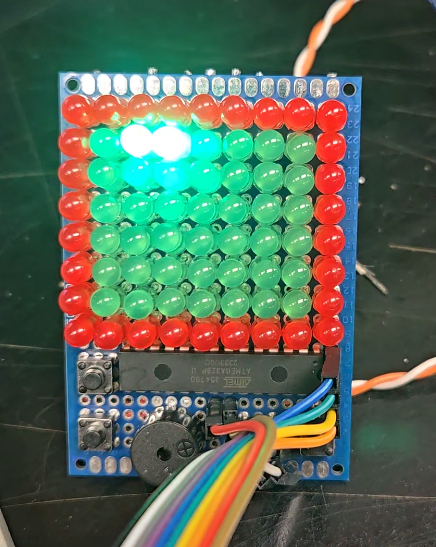

# GamingConsole
Custom Gaming console made with Led and ATMega328p microcontroller. The display is 9x8 charliplexed display made with red led for border and green led for inside. The Console has menu system. 

# Main menu
1. Snake Game
2. Test All Led
3. Lit All Led
4. Put Message

# Game Over Menu
1. Retry
2. Exit to Main Menu

# Pin Mapping
* PD0 -> Right Button(Programming Reset Pin With pullup resistor)
* PD1 -> Buzzer(Add 220 ohm resistor to protect from over current. Not shown in schematics. All LED have 220 ohm resistor.)
* PD2 -> Row1
* PD3 -> Row2
* PD4 ->  Row3
* PD5 -> Row4
* PD6 -> Row5
* PD7 -> Row6
* PB0 -> Row7
* PB1 -> Row8
* PB2 -> Row9
* PB3 -> Up Button(MOSI for programming)
* PB4 -> Down Button(MISO for programming)
* PB5 -> Left Button(SCK for programming)

# To Program
* Connect MOSI, MISO, SCK, and Reset(PD0) of ATMega328p to pin 11, 12, 13 and 10 of Arduino Uno respectively.
* Connect the arduino uno to the computer.
* Open arduino ide. Go to File->Examples->ArduinoISP->ArduinoISP. This should open a file named ArduinoISP on the ide. Press compile and upload. Then close the file.
* Next, Open GamingConsole.ino in arduino ide. Go to Tools->Programmer and select Arduino as ISP. 
* Now go to sketch and click Upload Using Programmer. This should upload the firmware to ATMega328p. Disconnect programming pins.

# Documentation 
* Wiring Diagram [📄 View the Console Manual (PDF)](docs/GamingConsole.pdf)
* Console's video 

  
  

